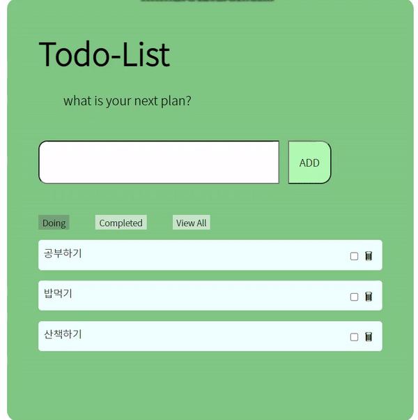

# Todo-List / TypeScript - React - Redux

<br>

> TypeScript, React, Redux를 활용하여 간단한 TodoList 미니프로젝트를 제작하였습니다

<br>

```
사용 된 기술 : React, Typescript, typesafe-actions, Redux, Redux Hook, typesafe-actions, CSS-Module
```

<br>

<p align="center"></p>
